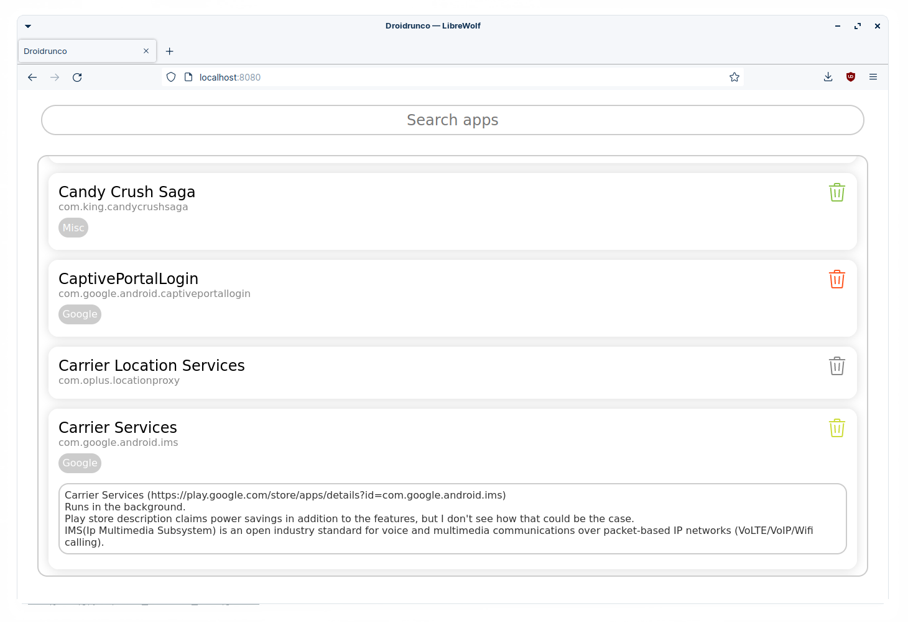

# Droidrunco
Your Android device. Cleaner.



- [Introduction](https://github.com/lavafroth/droidrunco#Introduction)
- [Installation](https://github.com/lavafroth/droidrunco#Installation)
- [Usage](https://github.com/lavafroth/droidrunco#Usage)
- [Demo](https://odysee.com/@lavafroth:d/droidrunco_wireless_debugging:d)
- [Acknowledgement](https://github.com/lavafroth/droidrunco#Acknowledgement)

[](https://goreportcard.com/report/github.com/lavafroth/debloatplusplus)

## Introduction

### What?

Droidrunco is a cross-platform web UI based application which utilizes `adb` to help
remove unwanted system apps ([bloatware](https://en.wikipedia.org/wiki/Software_bloat)) from
on all versions of Android with x86 or ARM processors without root access. This subsequently
increases storage space, reduces power consumption and hardens the user's privacy against
vendor distributed spyware.

### Why?

Despite the existence of projects like [the UAD project](https://github.com/0x192/Universal-Android-Debloater),
there has recently been a lot of trouble correlating package names with an app's label.
Manufacturers including Oppo, Xiaomi and the like use obscure package names for their spyware
apps which make it difficult if not impossible to remove them without playing Russian roulette
and risking a [bootloop](https://en.wikipedia.org/wiki/Bootloop).

### How?

Droidrunco solves the aforementioned issue by fetching the package names as well as app labels
using its extractor binaries. This can help the user get better insights on whether an app is
safe to get rid of.

With that said, a user still risks hitting a bootloop if they have absolutely
no idea of what they're doing.

## Installation

### Install ADB

#### Linux
- Debian: `sudo apt install android-sdk-platform-tools`
- Arch: `sudo pacman -S android-tools`
- Red Hat: `sudo yum install android-tools`
- OpenSUSE: `sudo zypper install android-tools`
- Termux: `pkg in android-tools`

#### macOS
Install [Homebrew](https://brew.sh/#install) and run the following in the terminal:    
```bash
brew install android-platform-tools
```

#### Windows
Install [Chocolatey](https://chocolatey.org/install#install-step2) and run the following in a PowerShell window with administrator privileges:
```powershell
choco install adb
```

### Install Droidrunco

Droidrunco can be installed in either of the following ways:

#### Using precompiled binaries
This is what most users will use since it does not involve setting up a development environment. Download the binary for your operating system from the [releases](https://github.com/lavafroth/droidrunco/releases).

#### From source

To build from source, please install [`just`](https://just.systems). It's being used as a replacement for the much complicated GNU `make` and `Makefile`s.

Clone the repository and create a clean build.

```bash
git clone https://github.com/lavafroth/droidrunco.git
cd droidrunco
just clean-build
```


## Usage
- Backup the data on your device before you accidentally screw up
- [Enable Developer Options and USB debugging on your device](https://developer.android.com/studio/debug/dev-options#enable)
- From the settings, disconnect from any OEM / vendor accounts (deleting an OEM account package could lock you on the lockscreen because the device can no longer associate your identity)
- Kill any previously running adb servers on the host
```
adb kill-server
```
- Run Droidrunco (this might need administrative rights depending on the operation system in use)
- Visit http://localhost:8080
- Start typing to search for an app
- Click the trash icon next to the app's entry to wipe it. The icon color indicated the severity of uninstalling the app.
  - Green: Recommended
  - Lime: Advanced
  - Yellow: Expert
  - Red: Unsafe
  - Gray: Untested
- If an essential system app gets accidentally removed and Droidrunco is still running, click the recycle icon next to the entry to restore it

## go run droidrunco

The best part about Droidrunco is that you can run the ARM version ([grab it from the latest release](https://github.com/lavafroth/droidrunco/releases/latest)) in [Termux](https://termux.dev/en/) and even debloat the Android 11+ devices of your friends or family.

- Backup the data on your device before you accidentally screw up
- [Enable Developer Options and USB debugging on your device](https://developer.android.com/studio/debug/dev-options#enable)
- In the aforementioned Developer Options, enable wireless debugging
- Under wireless debugging, click on pair a device, note down the given IP:PORT pair and the KEY.

- Open termux and run the following:

```
pkg in wget adb
adb connect IP:PORT KEY
```

Where IP, PORT and KEY are the identifiers noted from the wireless debugging menu.
Now the target device should get a notification stating that a debugger has been connected.
Finally run the following in Termux:

> Note: The version used here is 2.3.2 but you may use a higher version if available.

```
wget https://github.com/lavafroth/droidrunco/releases/download/v2.3.2/droidrunco-arm-linux
chmod +x droidrunco-arm-linux
./droidrunco-arm-linux
```

Open your browser and go to http://localhost:8080 and Droidrunco should be ready for use.

### Help wanted

As you can see, there is no easy way to run Droidrunco on a phone natively, like an app.
Also, I am terrible at Android development. If you are an Android developer who can help me
integrate [dadb](https://github.com/mobile-dev-inc/dadb) or [Shizuku](https://github.com/RikkaApps/Shizuku)
into a fully fleshed app, feel free to contact me.

## Acknowledgement
A huge thank you to [the UAD project](https://github.com/0x192/Universal-Android-Debloater) for their application knowledge base that is used in this project.
